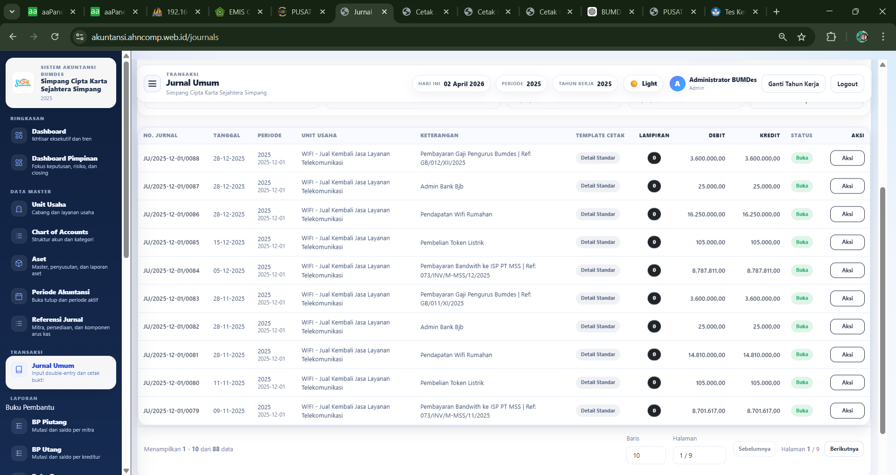
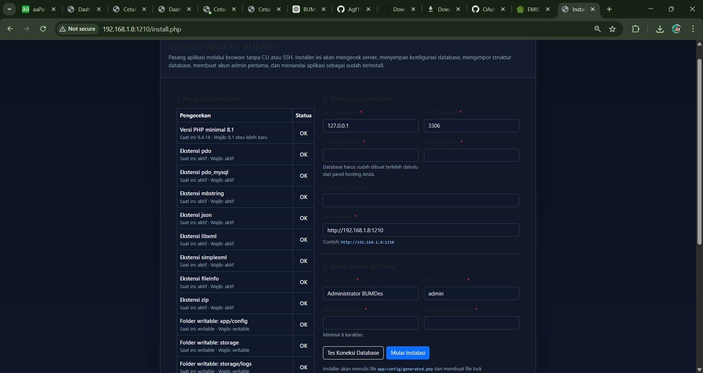
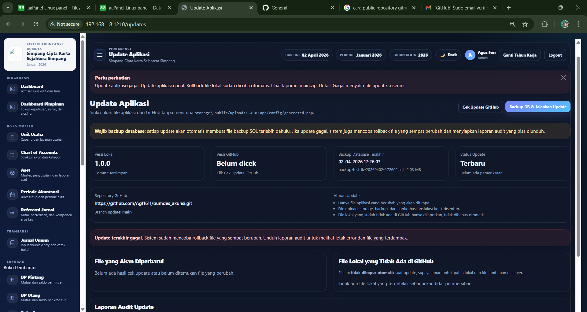

<div align="center">

# Sistem Akuntansi BUMDes

Aplikasi akuntansi BUMDes berbasis web untuk pencatatan jurnal umum, chart of accounts, aset, periode akuntansi, referensi jurnal, buku pembantu, dan pelaporan operasional harian.


</div>

---

## Ringkasan

Repository ini adalah versi **GitHub-ready** dan **install-ready** dari aplikasi akuntansi BUMDes. Paket ini sudah disiapkan agar bisa:

- di-upload ke hosting dan di-install lewat browser
- dijalankan di localhost memakai **XAMPP**
- disimpan di GitHub dengan struktur repo yang rapi
- di-update dari GitHub tanpa menimpa seluruh source secara membabi buta

---

## Preview Tampilan

### Jurnal Umum



### Installer Web



### Menu Update Aplikasi



> Simpan screenshot tambahan ke folder `docs/images/`, lalu panggil dari README dengan format ``.

---

## Fitur Utama

| Modul | Fungsi |
|---|---|
| Dashboard | Ringkasan kondisi aplikasi dan navigasi cepat |
| Jurnal Umum | Input jurnal, template cepat, lampiran, cetak, dan aksi massal |
| Chart of Accounts | Struktur akun dan kategori COA |
| Unit Usaha | Pengelompokan transaksi per unit usaha |
| Aset | Master aset, kategori aset, qty, penyusutan, dan nilai buku |
| Periode Akuntansi | Kontrol periode aktif, buka/tutup periode |
| Referensi Jurnal | Referensi mitra, persediaan, dan komponen arus kas |
| Import Jurnal | Import dari template Excel dengan validasi dan audit error |
| Update Aplikasi | Sinkron file aplikasi dari GitHub dengan backup database |
| Installer Web | Instalasi langsung dari browser tanpa CLI |

---

## Struktur Folder Penting

```text
app/                Source utama aplikasi
public/             Document root web server
public/uploads/     Upload runtime pengguna
storage/            Log, backup, import, attachment, cache runtime
database/           Schema dan patch SQL
docs/               Panduan deploy, release, audit, dan gambar README
scripts/            Utilitas bantu
install.php         Entry installer
index.php           Entry aplikasi
```

---

## Kebutuhan Server

### Minimum

- PHP **8.1+**
- MariaDB / MySQL
- Web server Apache / Nginx / LiteSpeed

### Ekstensi PHP yang disarankan

- `pdo`
- `pdo_mysql`
- `mbstring`
- `json`
- `libxml`
- `simplexml`
- `fileinfo`
- `zip`

### Folder yang harus writable

- `app/config/`
- `storage/`
- `storage/logs/`
- `storage/backups/`
- `storage/imports/`
- `storage/journal_attachments/`
- `public/uploads/`

---

## Instalasi Cepat di Hosting

### 1. Upload source code

Upload isi project ke hosting kamu, misalnya ke folder:

```text
/www/wwwroot/namadomain/
```

atau di shared hosting/cPanel ke:

```text
public_html/
```

### 2. Atur document root

Arahkan domain/subdomain ke folder:

```text
public/
```

Kalau document root tidak bisa diarahkan ke `public/`, pastikan file bootstrap root bawaan project tetap dipakai dengan benar sesuai konfigurasi hostingmu.

### 3. Buat database kosong

Buat database baru dari panel hosting, lalu simpan:

- host database
- port database
- nama database
- user database
- password database

### 4. Pastikan permission writable

Set folder runtime agar writable oleh PHP/web server.

### 5. Jalankan installer

Buka browser ke:

```text
http://domainkamu/install.php
```

Lalu isi:

- data database
- URL aplikasi
- akun admin pertama

### 6. Selesaikan instalasi

Setelah berhasil, installer akan membuat file runtime berikut otomatis:

- `app/config/generated.php`
- `storage/installed.lock`

---

## Instalasi di Localhost memakai XAMPP

### 1. Copy project ke folder htdocs

Contoh:

```text
C:\xampp\htdocs\akuntansi-bumdes
```

### 2. Jalankan Apache dan MySQL

Buka **XAMPP Control Panel**, lalu start:

- Apache
- MySQL

### 3. Buat database kosong

Masuk ke phpMyAdmin:

```text
http://localhost/phpmyadmin
```

Buat database baru, misalnya:

```text
bumdes_db
```

### 4. Buka installer

Kalau project diletakkan langsung di folder project:

```text
http://localhost/akuntansi-bumdes/install.php
```

Kalau kamu memakai virtual host atau port khusus, sesuaikan URL-nya.

### 5. Isi konfigurasi database

Contoh default XAMPP biasanya:

- Host: `127.0.0.1`
- Port: `3306`
- User: `root`
- Password: kosong atau sesuai konfigurasi kamu

### 6. Selesaikan wizard instalasi

Setelah selesai, login dengan akun admin yang tadi dibuat.

---

## Menyimpan Project di GitHub

### Upload manual lewat GitHub Desktop

1. Extract source code project
2. Buka **GitHub Desktop**
3. Pilih folder project
4. Commit semua file
5. Publish ke repository GitHub

### Upload lewat terminal Git

```bash
git init
git add .
git commit -m "chore: initial github-ready release"
git branch -M main
git remote add origin https://github.com/USERNAME/NAMA-REPO.git
git push -u origin main
```

### Buat release tag

```bash
git tag -a v1.0.0 -m "Initial GitHub-ready release"
git push origin v1.0.0
```

---

## Cara Update Aplikasi dari Menu Update

Menu update aplikasi dirancang untuk **mengganti file yang memang berubah saja**, bukan menimpa seluruh source secara buta.

### Alur update

1. Login sebagai admin
2. Buka menu **Update Aplikasi**
3. Klik **Cek Update GitHub**
4. Pastikan daftar file yang akan diperbarui sudah sesuai
5. Klik **Backup DB & Jalankan Update**

### Yang dibackup dulu sebelum update

- database SQL

### File yang tidak disentuh updater

- `storage/`
- `public/uploads/`
- `app/config/generated.php`
- file environment/server seperti `.env`, `.user.ini`, `user.ini`, `php.ini`

### Catatan

Kalau update gagal, sistem akan mencoba rollback file yang sempat berubah dan menyiapkan laporan audit.

---

## File yang Tidak Boleh Di-commit

Sudah ditangani oleh `.gitignore`, terutama:

- `app/config/generated.php`
- `storage/installed.lock`
- `storage/logs/*`
- `storage/backups/*`
- `storage/imports/*`
- `storage/journal_attachments/*`
- `public/uploads/*`

---

## Dokumentasi Tambahan

### Deploy

- `docs/deploy/INSTALL_GITHUB_DEPLOY.md`
- `docs/deploy/INSTALL_SHARED_HOSTING.md`
- `docs/deploy/INSTALL_LOCAL_XAMPP.md`
- `docs/deploy/PRODUCTION_UPDATE_GUIDE.md`

### Release

- `CHANGELOG.md`
- `VERSION`
- `RELEASE_TAG.txt`
- `docs/releases/RELEASE_TAGGING.md`
- `docs/releases/RELEASE_CHECKLIST.md`

### Audit

Semua catatan investigasi dan perbaikan ada di folder:

- `docs/audits/`

---

## Cara Menambahkan Gambar ke README

### 1. Simpan file gambar

Masukkan screenshot ke folder:

```text
docs/images/
```

Contoh nama file:

```text
docs/images/dashboard.png
```

### 2. Tampilkan di README

Pakai Markdown biasa:

```md

```

Atau kalau ingin mengatur lebar gambar:

```html

```

---

## Akun dan File Runtime Setelah Install

Setelah wizard install selesai, aplikasi akan membuat atau memakai file runtime berikut:

- `app/config/generated.php`
- `storage/installed.lock`
- file log di `storage/logs/`
- backup SQL di `storage/backups/`

File-file tersebut **tidak perlu** di-commit ke GitHub.

---

## Changelog dan Versi

- Lihat versi aplikasi di file `VERSION`
- Lihat perubahan rilis di file `CHANGELOG.md`
- Lihat tag rilis awal yang disarankan di `RELEASE_TAG.txt`

---

## Lisensi dan Penggunaan

Gunakan repository ini untuk operasional aplikasi akuntansi BUMDes, pengembangan internal, atau deployment server milik sendiri. Pastikan backup database dilakukan sebelum update produksi.
